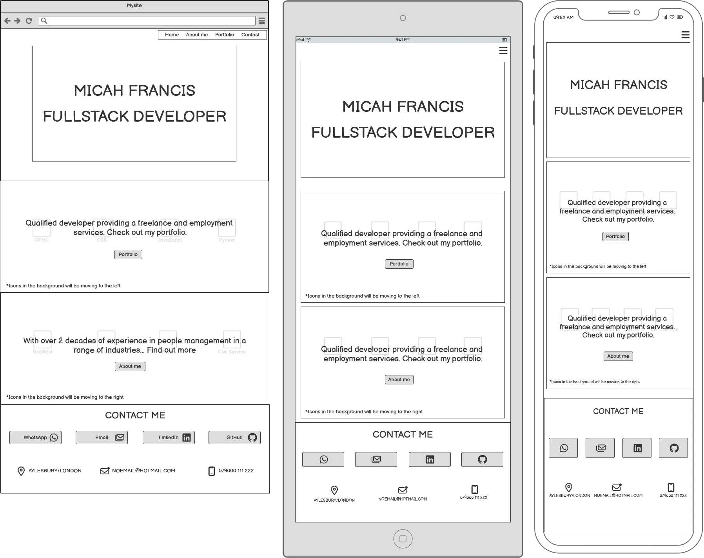
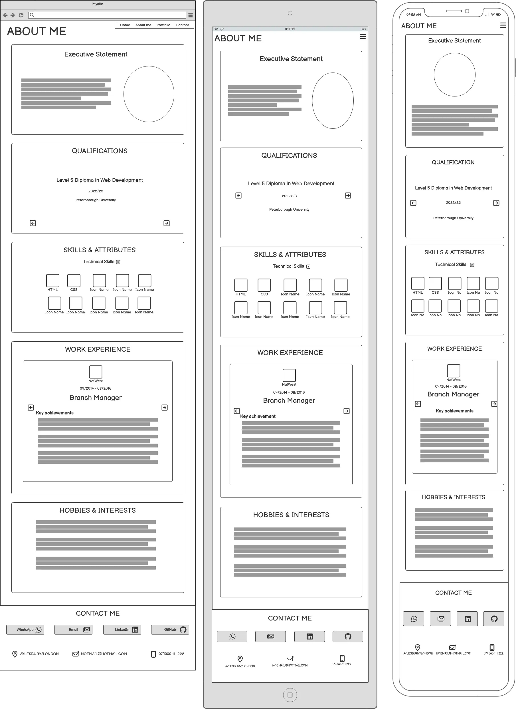
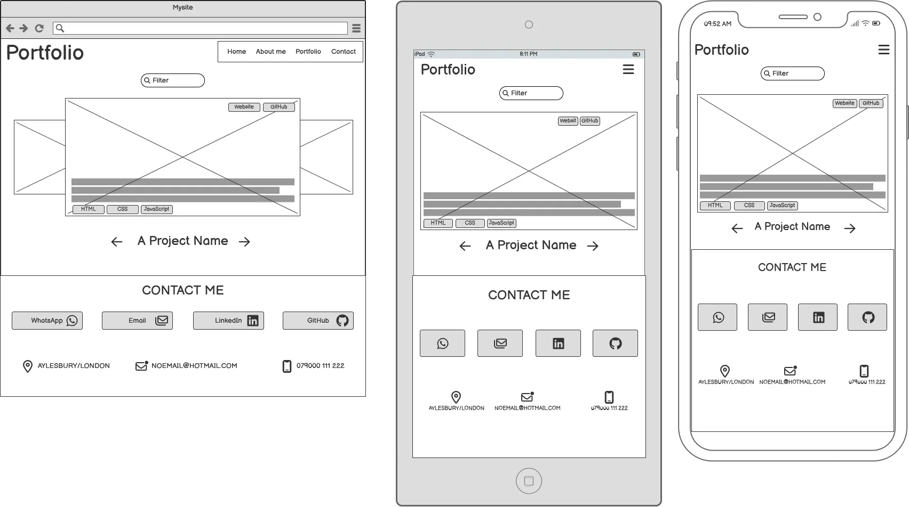

# micah-francis.com
## User Stories
### `Navigation`
-   I want to navigate between the Home, About Me, and Portfolio pages so that I can freely explore the site.
-   I want to be able to visually identify which page I am on using the navigation bar so that I know where I am.
___
### `Home Page`
* I want to be able to view a home page with an image
* I want clear options for which areas of the site I should visit so that I understand where the main features are.
___
### `About Me`
* I want to read a short bio about the owner so that I can learn a bit about them.
*  I want to view the owner’s qualifications so that I can validate their capabilities.
*   I want to view a list of the owner’s transferable skills and coding languages so that I can match them with potential job opportunities.
*  I want to view the owner’s work experience so that I can understand their level of expertise.
___
### `Portfolio`
-   I want to view an image and description of the owner’s projects so that I can gauge their coding experience.
-   I want to see the languages used in each project so I know what technologies they can work with.
-   I want to be able to filter projects based on languages used so I can quickly find those that use specific coding languages.
-   I want links to the websites so that I can experience the sites myself.
___
### `Contact`
* I want to view links to the owners social media and other contact details.
## Future Features
* Owner would like to add a blog so that they can support beginners along their coding journey.
## Colour & Typography
### `Colour`
||Fonts|CTA Buttons|Buttons(border)|Body|
|-|-|-|-|-|
|Dark Magenta - #8F008F|-|✅|
|Dark Amethyst - #4D054C|-|-|
|Black - #0A0908|✅|-|✅||
|White Smoke - #F2F4F3|-|-||✅|

### `Fonts`
||h1 tag|Rest|
|-|-|-|
|BBH Hegarty|✅|-|
|Noto sans|-|✅|
## Wireframes

| Home | About me | Portfolio |
|---|---|---|
|  |  |  |

## Technologies
### `Resources`
* HTML
* CSS
* Javascript
* VSCode
* [React.js](https://react.dev/)
* [React Router](https://v5.reactrouter.com/web/guides/quick-start)
* [Motion — JavaScript & React animation library](https://motion.dev/)
* Microsoft Copilot
* [Google Fonts](https://fonts.google.com/)
* [Font Awesome version 5](https://fontawesome.com/)
* [JPG Converter | CloudConvert](https://cloudconvert.com/jpg-converter)
* [The W3C Markup Validation Service](https://validator.w3.org/)
* [JSHint, a JavaScript Code Quality Tool](https://jshint.com/)
## LOCAL DEVELOPMENT
### Clone Repository
1. Login/Sign up to [GitHub]([GitHub](https://github.com/)
2. Go to the project repository [Math-Game]([2ndborn/math-game](https://github.com/2ndborn/math-game)
3. Click on the green code button, select whether you would like to clone with **HTTPS**, SSH or GitHub CLI and copy the link shown.
4. Open the terminal in your code editor and change the current working directory to the location you want to use for the cloned directory. ls (list the files and folder) cd <name of location/directory>(change directory)
5. Type the following command in the terminal (after the git clone you will need to paste the link you copied in step 3 above):
6. Set up a virtual environment (this step is not required if you are using the Code Institute Template in GitPod as this will already be set up for you).
7. Run the server:
## Deployment
1. Go to the project repository [Math-Game]([2ndborn/math-game](https://github.com/2ndborn/math-game)
2. Go to settings, located at the top.
3. Go to pages, located on the left under **Code and automation.**
4. Under **Branch** switch from **None** to **Main**, then save.
5. You should now see the site address at the top of the page.
