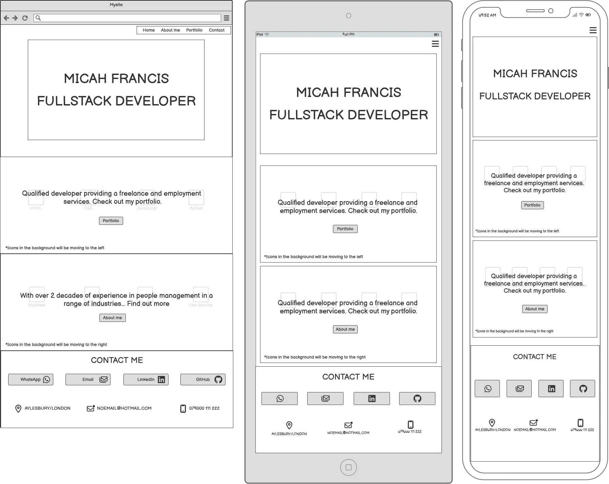
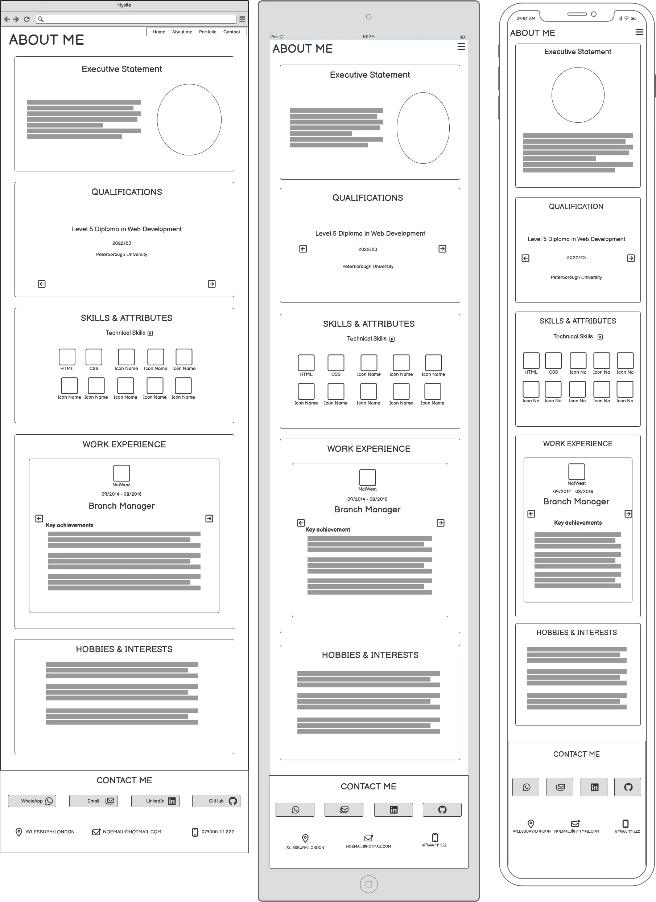
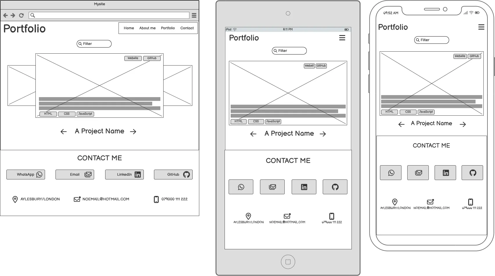

# Micah Francis
## User Stories
### `Navigation`
-   I want to navigate between the Home, About Me, and Portfolio pages so that I can freely explore the site.
-   I want to be able to visually identify which page I am on using the navigation bar so that I know where I am.
___
### `Home Page`
* I want to be able to view a home page with an image
* I want clear options for which areas of the site I should visit so that I understand where the main features are.
___
### `About Me`
* I want to read a short bio about the owner so that I can learn a bit about them.
*  I want to view the owner’s qualifications so that I can validate their capabilities.
*   I want to view a list of the owner’s transferable skills and coding languages so that I can match them with potential job opportunities.
*  I want to view the owner’s work experience so that I can understand their level of expertise.
___
### `Portfolio`
-   I want to view an image and description of the owner’s projects so that I can gauge their coding experience.
-   I want to see the languages used in each project so I know what technologies they can work with.
-   I want to be able to filter projects based on languages used so I can quickly find those that use specific coding languages.
-   I want links to the websites so that I can experience the sites myself.
___
### `Contact`
* I want to view links to the owners social media and other contact details.
## Future Features
* Owner would like to add a blog so that they can support beginners along their coding journey.
## Colour & Typography
### `Colour`
||Fonts|CTA Buttons|Buttons(border)|Body|
|-|-|-|-|-|
|Dark Magenta - #8F008F|-|✅|
|Dark Amethyst - #4D054C|-|-|
|Black - #0A0908|✅|-|✅||
|White Smoke - #F2F4F3|-|-||✅|

### `Fonts`
||h1 tag|Rest|
|-|-|-|
|BBH Hegarty|✅|-|
|Noto sans|-|✅|
## Wireframes
| Home | About me | Portfolio |
|---|---|---|
||||
## Technologies
### `Resources`
* HTML
* CSS
* Javascript
* VSCode
* [Vite](https://vite.dev/)
* [React Router](https://v5.reactrouter.com/web/guides/quick-start)
* [Motion — JavaScript & React animation library](https://motion.dev/)
* Microsoft Copilot
* [Google Fonts](https://fonts.google.com/)
* [Font Awesome version 5](https://fontawesome.com/)
* [JPG Converter | CloudConvert](https://cloudconvert.com/jpg-converter)
* [The W3C Markup Validation Service](https://validator.w3.org/)
* [JSHint, a JavaScript Code Quality Tool](https://jshint.com/)

## Fixed bugs
### Disappearing "See more" button
I originally asked AI to help me implement a “See more” button that would reveal the remainder of a list. The solution worked in terms of expanding the list, but the button itself disappeared after being clicked.I had asked AI to help me to code a see more button that would reveal the remainder of a list. The solution it provided would reveal the the list but the button would disappear. 

Conditional code

	  <pre><code>{!showMore && ex.achievements.length > 3 && ()}</code></pre>
	

Button code

	  <pre><code>onClick={() => setShowMore(prev => !prev)}
    {!showMore ? "See more" : "See less"}
</code></pre>
	

	
To fix the issue, I removed the `!showMore &&` portion of the condition. This prevented the button from unmounting and solved the disappearing behaviour.

	
**{ex.achievements.length > 3 && (
  <button onClick={() => setShowMore(prev => !prev)}>
    {!showMore ? "See more" : "See less"} </button>
)}**

### Different card sizes on the carousel

In the Education section of the _About Me_ page, the cards were rendering at different heights, which made the carousel look inconsistent. The final row of the grid contained a paragraph, and one card had three lines while another had four. This caused the outer wrapper to render at different sizes.

	  <pre><code>.desc {
	grid-area: 3 / 1 / 4 / -1;
	text-align: justify  !important;
	font-size: clamp(1rem, 0.909rem  +  0.45vw, 1.25rem);
}	  </code></pre>
	

The solution was to add a fixed `min-height` of **200px** to the `.desc` row so that all cards render at a consistent height.

	  <pre><code>.desc {
	grid-area: 3 / 1 / 4 / -1;
	min-height: 200px;
	text-align: justify  !important;
	font-size: clamp(1rem, 0.909rem  +  0.45vw, 1.25rem);
}	  </code></pre>
	

### See more button
Another issue was that the “See more” button updated the state for **every** card simultaneously. The intended behaviour was for each card to expand independently.

#### 1. Previous state

	  <pre><code>	const [showMore, setShowMore] = useState(false); </code></pre>
	

#### 2. Previous toggle function

	  <pre><code>	const toggle = () => {
		setShowMore(prev => {
			const next = !prev;
			setPaused(next);
			return next;
		})
	}
</code></pre>
	

#### 3. Previous onClick

<pre><code><button>
	onClick={toggle}onClick={() => toggle(i)}
</button>
</code></pre>
	

After reviewing the logic, I realised the issue was caused by using a **boolean** for `showMore`. A boolean only allows two states: `true` or `false`, so all cards were reacting to the same shared value.

By switching to `null` as the initial state, each card can be controlled by its **index**, allowing only one card to be expanded at a time.

#### 1. Updated state
	

	  <pre><code>	const [showMore, setShowMore] = useState(null); </code></pre>
	

#### 2. Updated toggle function
	

	  <pre><code>	const toggle = (i) => {
			setShowMore(prev => {
				const next = prev === i ? null :  i ;
				setPaused(next);
				return next;
			})
		}</code></pre>
	

	
#### 3. Updated onClick
	
<pre><code><button>
	onClick={toggle}onClick={() => toggle(i)}
</button>
</code></pre>
	

Now, clicking “See more” expands only the selected card. If the user navigates to another card and clicks “See more,” the previous card resets to `null` and the new card becomes active.

### Overflow on the Home page
Every time the Home page loaded, there was an initial overflow that disappeared only after scrolling. The animation that pans in from the left and right appeared to be triggering immediately on page load, even before the user scrolled.

At first, I tried adding `overflow: hidden` to the container, but that only prevented the animation from appearing. After further testing, I realised the animation _was_ firing — but it was firing **behind the global overlay** I had recently added, which briefly covers the page while scrolling to the top.

Because the section was already in view on load, the animation triggered instantly.

After consulting a [Framer Motion tutorial](https://youtu.be/IhhucYgv7RY?si=my7CjVhhzcwy_-1w), I learned about the `useInView` hook and the `amount` option, which allows you to specify how much of the element must be visible before the animation fires.

	  <pre><code>	const  inView  =  useInView(ref, {once: false});</code></pre>
	

By adding an amount I could ensure that that animation won't fire until 30% of the element is visible:

	  <pre><code>	const  inView  =  useInView(ref, {once: false, amount: 0.3}); </code></pre>
	

By requiring 30% of the element to be visible before triggering the animation, the overflow issue was resolved and the animation now fires at the correct time.

[## Testing](../micah/TESTING.md)

## LOCAL DEVELOPMENT
### Clone Repository
1. Login/Sign up to [GitHub]([GitHub](https://github.com/)
2. Go to the project repository [Math-Game]([2ndborn/math-game](https://github.com/2ndborn/math-game)
3. Click on the green code button, select whether you would like to clone with **HTTPS**, SSH or GitHub CLI and copy the link shown.
4. Open the terminal in your code editor and change the current working directory to the location you want to use for the cloned directory. ls (list the files and folder) cd <name of location/directory>(change directory)
5. Type the following command in the terminal (after the git clone you will need to paste the link you copied in step 3 above):
6. Install Vite: 

	  <pre><code>
	  npm create vite@latest
	  </code></pre>
	

7. Pick a project name: micah-francis.com
8. Select a variable: For this project pick JavaScript + SWC
9. Lauch the React app in the browser: 

	  <pre><code>
		cd micah-francis.com
		npm run dev
	  </code></pre>
	

10. You should see the following: 

	  <pre><code>
	  ➜ Local: http://localhost:5173/ 
	  ➜ Network: use --host to expose 
	  ➜ press h + enter to show help
	  *Click the Local: link to open the browswer*
	  </code></pre>
	

## Deployment
1. Go to the project repository [micah-francis.com](https://github.com/2ndborn/micah-francis.com/tree/main)
2. Go to settings, located at the top.
3. Go to pages, located on the left under **Code and automation.**
4. Under **Branch** switch from **None** to **Main**, then save.
5. You should now see the site address at the top of the page.